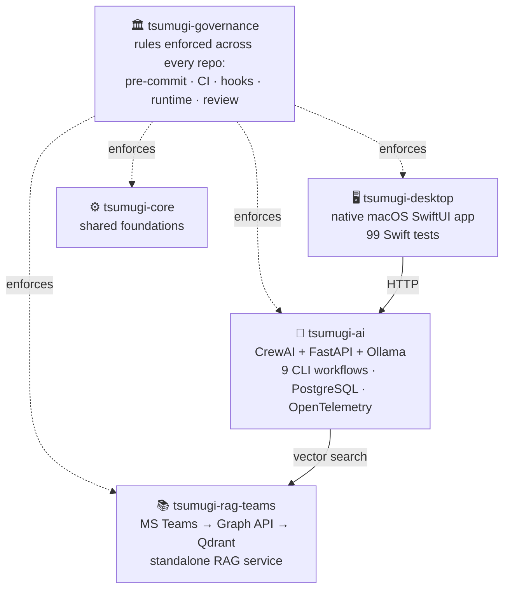

 

**Zero Trust security architecture. AI agent operating systems. Eight languages, four domains, one engineer.**

Not a specialist who learned to fake breadth — a generalist who happens to be dangerous at security.

 

EN / 日本語 — one click apart, inside the portfolio

 

---

## 🌐 The Skill Constellation

Every node here is something I've shipped in production, not a tutorial I once followed — live commit history below is the receipt.

## 📡 GitHub Activity

Third-party stat badges go down more often than my production systems do, so these are self-rendered straight from the GitHub API — no dependency on someone else's free-tier deployment.

## 🧪 The Lab — what I build when nobody's paying

> "Using AI" is table stakes. I build the **systems that let AI agents run autonomously and safely** — the harder, less-glamorous problem enterprises need solved next.

### `tsumugi` — a personal AI agent platform, built like an enterprise system

Five repos, ~4 months, engineered in parallel — with the governance layer most companies don't build for their production systems:

### This repo — a "constitution" for AI agents

The page you're reading is served from an experiment: **can cheaper models operate with frontier-model discipline if you write the discipline down?** A 22-chapter operating charter (decision priority, evidence protocol, stop conditions), a 12-section decision-heuristics reference, 8 least-privilege sub-agent definitions, and a blinded model-comparison protocol. All in this repo, all inspectable.

### And the rest

| Project | One line |
|---|---|
| `spec-backborn` | Spec-driven development, studied at full speed — **2,211 commits in under a week**, 300+ sub-specs, Next.js 15 / Prisma 6 / Testcontainers / Playwright. |
| `NEXUS TRADE` | Multi-broker AI trading dashboard, rebuilt across 3 generations — paper-trading adapters plus real order placement via Playwright automation. |
| [`redmine_budget`](https://github.com/ultimania/redmine_budget) | Shipped, starred, maintained **public OSS** — plan-vs-actual effort tracking for Redmine. |

## 🛠 Arsenal

**Security & Identity** — the specialty

**Languages** — a decade across eight of them

**Cloud & Platform**

**AI & Agents** — where the lab work lives

 

---

### One engineer. Four domains. Zero specialization tunnel vision.

If your stack doesn't fit in one box, neither do I.

 

  

[Portfolio](https://ultimania.github.io/ultimania/) ・ [The Lab](https://ultimania.github.io/ultimania/#lab) ・ [GitHub](https://github.com/ultimania)

