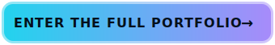
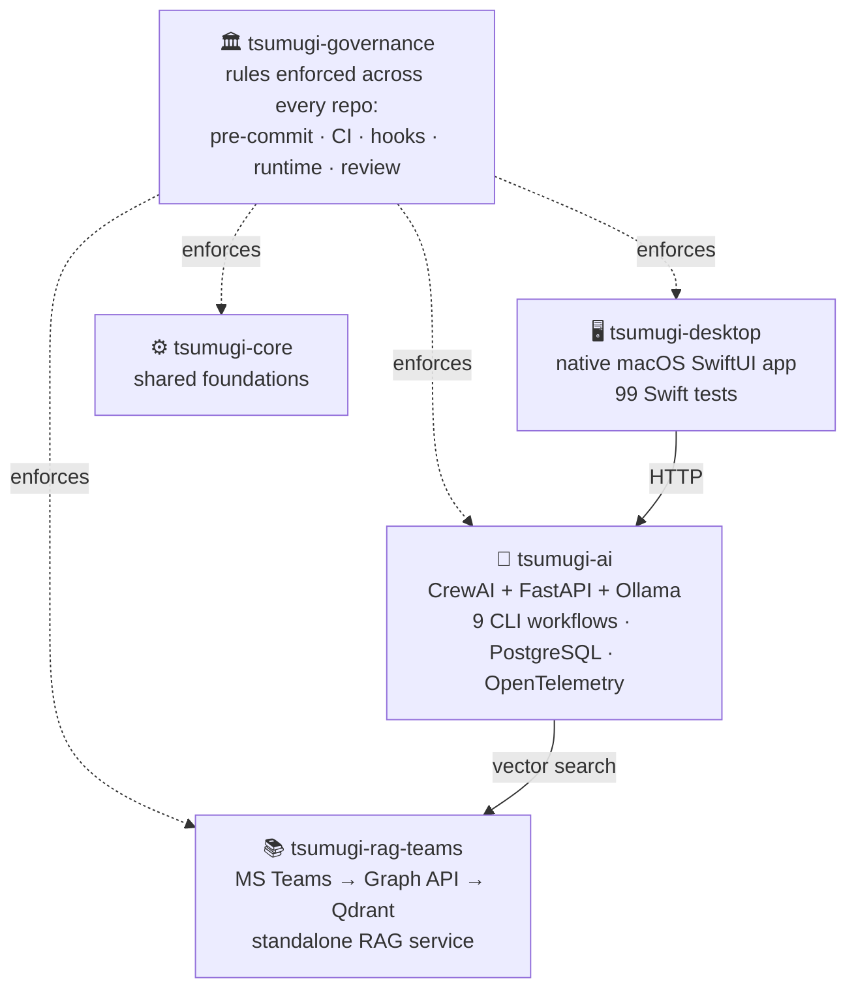

 

**By day, I architect Zero Trust for national-scale enterprises. 
By night, I build the operating systems that let AI agents work unsupervised.**

Ten years turning chaos — technical, organizational, and now agentic — into systems that hold.

 

EN / 日本語 — one click apart, inside the portfolio

 

---

## ⚡ Most engineers list skills. Here are receipts.

- Led the **Zero Trust API platform PoC for a national automaker** — Apigee governance, OAuth2.0/OIDC SSO/MFA on EntraID, RBAC/ABAC authorization, designed end-to-end and **signed off by the client on technical feasibility**.
- Walked into a project **failing on quality, cost, and schedule**. Walked out with an **on-time delivery** and a client who asked for more.
- Served as **standing technical advisor to a major life insurer's private-cloud team** — five separate project teams brought in their problems within my first month. *Concurrently with the turnaround above.*
- Took a **data-analytics product from 0→1**: grand design → build → quarterly enterprise webinars as lead speaker → pre-sales. Five companies inbound, three in active deal talks.
- Replaced a team's default SpringBatch with a **Bash-based batch that cut container startup by 1–3 minutes** — adopted department-wide. Sometimes the boring tool is the senior move.
- And on my own time: a **5-repo personal AI agent platform**, a **spec-driven-development testbed with 2,211 commits in under a week**, and **public OSS that strangers actually star and use**.

<a href="https://ultimania.github.io/ultimania/#career">full career record, with dates and stacks →</a>

## 🛡 The Record — a decade at national scale

| When | Engagement | What actually happened |
|---|---|---|
| 2024–25 | **National automaker** — company-wide Zero Trust API platform (PoC) | Tech lead. Apigee API governance, OAuth2.0/OIDC SSO/MFA on EntraID, RBAC/ABAC — architecture to working proof, end-to-end. |
| 2025–26 | **Insurance** — agency evaluation system, greenfield | Tech lead. Designed a custom Lambda framework for offline-capable environments. |
| 2025 | **Government agency** — new-law application system | Built on AWS/Go/React while introducing GitHub Copilot and AI-driven development practice to the team, from the inside. |
| 2024–25 | **Major law firm** — data platform | Snowflake × AWS warehouse; killed the Excel workflows, rewrote the analysis SQL for performance. |
| 2023–24 | **Mutual-aid infra renewal** — 🔥 turnaround | Inherited a project failing on quality, cost, expertise, and schedule. Diagnosed on-site, drove the recovery, became the cross-team escalation point. **Delivered on time.** |
| 2023–24 | **Major life insurer** — technical advisor | Reviewed private-cloud designs and deliverables; ran a standing technical clinic. 5 teams in the door within month one. |
| 2022–23 | **In-house data product** — 0→1 founder role | Grand design, tech selection, build, quarterly webinars (lead speaker), pre-sales. Kubernetes + OSS, vendor-neutral, IaC one-step deploy. |
| 2021–22 | **Consumer reservation service** — microservices | Solo-built a fraud-detection API, requirements to release. The Bash batch story above. |
| 2016–21 | **SIer years** — OSS internals → PM | Customized OpenStack Keystone (Python) and OpenAM/OpenIG (Java) at the source level; then full-cycle PM. DevOps seminar series, ~100 attendees. |

## 🧪 The Lab — what I build when nobody's paying

> "Using AI" is table stakes. I build the **systems that let AI agents run autonomously and safely** — the harder, less-glamorous problem enterprises need solved next.

### `tsumugi` — a personal AI agent platform, built like an enterprise system

Five repos, ~4 months, engineered in parallel — with the governance layer most companies don't build for their production systems:

### This repo — a "constitution" for AI agents

The page you're reading is served from an experiment: **can cheaper models operate with frontier-model discipline if you write the discipline down?** A 22-chapter operating charter (decision priority, evidence protocol, stop conditions), a 12-section decision-heuristics reference, 8 least-privilege sub-agent definitions, and a blinded model-comparison protocol. All in this repo, all inspectable.

### And the rest

| Project | One line |
|---|---|
| `spec-backborn` | Spec-driven development, studied at full speed — **2,211 commits in under a week**, 300+ sub-specs, Next.js 15 / Prisma 6 / Testcontainers / Playwright. |
| `NEXUS TRADE` | Multi-broker AI trading dashboard, rebuilt across 3 generations — paper-trading adapters plus real order placement via Playwright automation. |
| [`redmine_budget`](https://github.com/ultimania/redmine_budget) | Shipped, starred, maintained **public OSS** — plan-vs-actual effort tracking for Redmine. |

## 🛠 Arsenal

**Security & Identity** — the specialty

**Languages** — a decade across nine of them

**Cloud & Platform**

**AI & Agents** — where the lab work lives

 

---

### Built it. Rescued it. Sold it. Taught it. **All of it, myself.**

The next team to run AI-agent-first engineering might be yours.

 

  

[Portfolio](https://ultimania.github.io/ultimania/) ・ [Career record](https://ultimania.github.io/ultimania/#career) ・ [The Lab](https://ultimania.github.io/ultimania/#lab) ・ [GitHub](https://github.com/ultimania)

